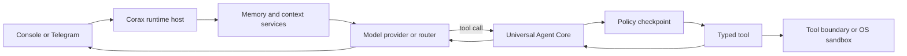

# Corax Agent


Corax is a local-first agent runtime with a full-screen terminal interface,
typed extensions, persistent sessions, optional long-term memory, Telegram
access, and a policy-enforced execution kernel.

The project is intentionally split across small repositories. `agent-core`
remains the universal execution kernel; Corax composes it with tools, model and
channel connectors, memory providers, and host-only runtime services. Only
tools are exposed to the model.

## Production model

Corax is distributed as a source composition pinned to immutable Git commits.
The installer creates an isolated Python environment, checks out every
component at the release lock, and writes one `corax` launcher. It does not
modify the global Python installation or overwrite an existing deployment.

Current runtime requirements:

- macOS or Linux;
- Python 3.12 or newer;
- Git;
- an OpenAI-compatible model endpoint;
- Docker, or macOS Seatbelt, when the shell tool is enabled.

Telegram, SearXNG, MCP servers, and durable memory services are optional.

## Install

Use the reproducible installer from
[`corax-distribution`](https://github.com/Alex12571333/corax-distribution):

```bash
git clone https://github.com/Alex12571333/corax-distribution.git
cd corax-distribution

# Inspect the exact repositories, commits, and commands first.
python3 -m corax_distribution --prefix ~/.corax --dry-run

# Install into a fresh prefix.
python3 -m corax_distribution --prefix ~/.corax

# Configure and verify the agent.
~/.corax/bin/corax setup
~/.corax/bin/corax doctor
```

The installed configuration is stored at `~/.corax/runtime/corax.yaml`.
Runtime data, audit records, checkpoints, traces, and logs stay under the same
runtime directory unless the paths are changed in the configuration.

## First run

Start the full-screen terminal interface:

```bash
~/.corax/bin/corax
# The explicit form is equivalent:
~/.corax/bin/corax tui
```

On a new installation Corax launches a guided terminal setup before opening
chat. The wizard:

1. acknowledges the execution risk;
2. selects the workspace;
3. configures an OpenAI-compatible endpoint and model;
4. verifies inference with a real minimal completion;
5. selects memory and security modes;
6. optionally enables Telegram.

Run `corax setup` again at any time. Existing values are offered as defaults.
Secrets are read from environment variables and are never written to
`corax.yaml`.

Use `corax chat` when a simple line-oriented console is preferable, for
example in a minimal terminal or while diagnosing display compatibility.

Inside terminal chat, use:

```text
/help
/new
/status
/approve
/deny
/security status
/security mode ask
/security mode auto
/security mode full
/security mode full <challenge>
/security approve <task-id>
/security deny <task-id>
/memory status
/memory search <query>
/memory remember <text>
/exit
```

`/approve` and `/deny` resolve the current pending tool request without asking
you to copy its task ID. The explicit `/security approve <task-id>` and
`/security deny <task-id>` forms remain available.

## Interface

`corax` opens the full-screen
[`corax-tui`](https://github.com/Alex12571333/corax-tui) by default. It keeps
the transcript scrollable while model output arrives, separates real-time
thinking from the answer, and lets you collapse thinking with `Ctrl-T`.
Typing `/` opens command suggestions with descriptions. The fixed status bar
shows the active model, context use, security mode, memory provider, and
session. Corax discovers the selected model's real context window from its
OpenAI-compatible `/models` metadata and updates current use from streaming
`prompt_tokens`. Until exact usage arrives it shows a clearly marked estimate;
the context manager's independent character compaction budget is never shown
as if it were the model's token limit.

`Page Up`, `Page Down`, and the mouse wheel detach the transcript from live
output without streaming deltas snapping it back to the bottom. `Ctrl-End`
returns to live follow mode. The raven uses a continuously animated truecolor
scan beam when the terminal supports 24-bit color.

Every model-selected tool is visible. The TUI and classic console show the
tool name, safe argument summary, approval state, and completion or failure;
Telegram sends the same start, approval, and outcome activity as separate
messages. Raw tool payloads and secret-like arguments are not rendered.

`corax chat` uses the same streaming chat loop and event contract in a
line-oriented renderer. It preserves real-time thinking, answers, approval
resume, and tool visibility without taking over the terminal screen.

Both terminal surfaces use the shared
[`corax-ui`](https://github.com/Alex12571333/corax-ui) visual contract: a
palette designed for near-black terminals, cyan-to-white-to-ultraviolet
holographic light, thin technical borders, compact status labels, and the
Corax raven.

`corax-ui` is a host library, not an Agent Core extension or a model-callable
tool. Its platform-neutral `tokens.json` is the source of truth for color,
typography, spacing, and radius. Future web or desktop surfaces can consume the
same semantic tokens without moving presentation policy into `agent-core`.

Color is enabled automatically for an interactive terminal. Override detection
when needed:

```bash
CORAX_COLOR=always corax
CORAX_COLOR=never corax
NO_COLOR=1 corax
```

Model and tool text is stripped of terminal control sequences before display.
Meaning is always repeated in text or symbols; color is never the only signal.

## CLI

| Command | Purpose |
| --- | --- |
| `corax` or `corax tui` | Open the full-screen terminal interface. |
| `corax chat` | Open the line-oriented streaming console fallback. |
| `corax setup` | Run the guided setup wizard. |
| `corax settings` | Open the advanced terminal settings menu. |
| `corax gateway` | Run the Telegram gateway. |
| `corax status` | Show loaded extensions and runtime health. |
| `corax doctor` | Run offline readiness checks. |
| `corax security status` | Show the active permission mode. |
| `corax security mode ask\|auto\|full` | Change the permission mode. |
| `corax mcp status` / `corax mcp tools` | Inspect MCP connections and discovered tools. |
| `corax skills list` / `corax skills reload` | Inspect or reload trusted Agent Skills. |
| `corax hooks status` / `corax hooks reload` | Inspect or reload approved hooks. |
| `corax subagents` | Show delegation limits and counters. |
| `corax sandbox` | Show the active isolation backend. |
| `corax models` | Show model routes and fallbacks. |
| `corax observability` | Show the bounded local trace sink. |
| `corax eval` | Run ecosystem contract checks when `corax-evals` is installed. |
| `corax init` | Create configuration and runtime directories, then exit. |

Use another configuration file with
`corax --config /path/to/corax.yaml <command>`.

## Security

The default mode is `ask`.

| Mode | Behaviour |
| --- | --- |
| `ask` | Safe read-only work runs; guarded actions require operator confirmation. |
| `auto` | A deterministic reviewer allows declared low/medium-risk work and asks for high, critical, dangerous, or unknown work. Reviewer errors fail closed. |
| `full` | The policy layer permits work except immutable hard denials. Tool and OS boundaries still apply. |

Entering `full` is deliberately a two-step operation:

```bash
corax security mode ask
corax security mode auto

# Request full mode; Corax prints a short challenge.
corax security mode full
# Repeat the command with that exact challenge.
corax security mode full <challenge>
```

The same grammar is available inside terminal chat with a leading slash:
`/security mode ask`, `/security mode auto`, and the two-step
`/security mode full` sequence.

`full` does not disable blocked capabilities, administrator deny lists,
workspace confinement, shell validation, network restrictions, or the OS
sandbox. The selected policy is injected into Agent Core by the host and is
never exposed as a model-callable tool.

For remote Telegram control, allow only explicit administrators:

```bash
export CORAX_SECURITY_ADMIN_IDS="12345,67890"
export CORAX_TELEGRAM_ALLOWED_CHATS="12345,67890"
```

Security mode changes are persisted atomically. Control events are written to
an append-only JSONL audit log with secret-like values redacted.

## Memory

Memory is integrated into both console and Telegram turns:

```text
user turn
  -> bounded recall
  -> recalled text inserted as untrusted context
  -> model and tool execution
  -> privacy-aware retention
```

The stock configuration uses `memory.none`, so long-term retention is off until
the operator selects a backend. The production composition includes two typed
providers:

- [`universal-agent-memory`](https://github.com/Alex12571333/universal-agent-memory)
  for a durable, self-hosted memory service;
- [`mnemonic-vault`](https://github.com/Alex12571333/mnemonic-vault) for a
  file-first long-term memory service.

Select the provider with `corax setup`. Set `UAM_API_KEY` or
`MNEMONIC_VAULT_API_TOKEN` in the environment when the selected service
requires authentication. The memory loop bounds recalled context, treats it
as data rather than instructions, and rejects secret-like facts during
retention. Console conversation checkpoints are independent of long-term
memory and are stored by `state.file`.

## Configuration and secrets

Use `corax setup` for onboarding and `corax settings` for advanced edits. The
configuration may be YAML or JSON; see [`docs/CONFIG.md`](docs/CONFIG.md) for
the complete schema.

Common secret and integration variables:

| Variable | Purpose |
| --- | --- |
| `CORAX_LLM_API_KEY` | Bearer token for the OpenAI-compatible model endpoint. |
| `CORAX_TELEGRAM_BOT_TOKEN` | Telegram bot token. |
| `CORAX_TELEGRAM_ALLOWED_CHATS` | Comma-separated Telegram chat allow-list. |
| `CORAX_SECURITY_ADMIN_IDS` | Remote actors allowed to change policy or resolve approvals. |
| `CORAX_WEBSEARCH_TOKEN` | Optional bearer token for the configured SearXNG proxy. |
| `UAM_API_KEY` | Universal Agent Memory credential. |
| `MNEMONIC_VAULT_API_TOKEN` | Mnemonic Vault credential. |
| `CORAX_MCP_SERVERS_JSON` | MCP server definitions. |
| `CORAX_SKILLS_PATHS` | Trusted Skill roots separated by the OS path separator. |
| `CORAX_HOOKS_JSON` | Lifecycle hook definitions. |
| `CORAX_HOOK_APPROVALS_JSON` | Approved hook fingerprints. |
| `CORAX_SANDBOX_BACKEND` | `auto`, `seatbelt`, or `docker`. |
| `CORAX_COLOR` | Terminal color policy: `auto`, `always`, or `never`. |
| `NO_COLOR` | Disable terminal color when `CORAX_COLOR` is not explicit. |

Do not store tokens in `corax.yaml`, prompts, extension manifests, or Git.

## Architecture



The package kind defines how a component participates in the runtime:

| Kind | Responsibility | Model-callable |
| --- | --- | --- |
| `tool` | Performs an action selected by the model. | Yes, through Agent Core. |
| `channel_connector` | Receives and sends messages. | No. |
| `model_provider` | Calls or hosts a model. | No. |
| `memory_provider` | Stores and recalls long-lived memory. | No. |
| `policy_provider` | Makes authorization decisions. | No. |
| `runtime_service` | Runs host orchestration such as MCP, hooks, or memory flow. | No. |
| `storage_provider` | Persists host and session state. | No. |
| `observability` | Receives redacted execution records. | No. |

This boundary is the main architectural invariant: a component does not become
a tool merely because it has callable methods. Security, memory, models,
channels, storage, and orchestration never enter the model's tool registry.

### Repository map

Foundation:

| Repository | Role |
| --- | --- |
| [`agent-core`](https://github.com/Alex12571333/agent-core) | Universal execution kernel: tasks, routing, policy checkpoints, stores, events, and traces. It has no Corax dependency. |
| [`agent-sdk`](https://github.com/Alex12571333/agent-sdk) | Typed extension contracts, decorators, manifests, and validation. |

Host and operator surfaces:

| Repository | Role |
| --- | --- |
| [`corax-agent`](https://github.com/Alex12571333/corax-agent) | Composition host, lifecycle, configuration, CLI, and runtime bindings. |
| [`corax-console`](https://github.com/Alex12571333/corax-console) | First-run wizard and interactive terminal chat. |
| [`corax-tui`](https://github.com/Alex12571333/corax-tui) | Full-screen terminal host: streaming transcript, thinking, tool activity, approvals, context bar, and slash completion. |
| [`corax-ui`](https://github.com/Alex12571333/corax-ui) | Shared design tokens and dependency-free terminal renderer; not a runtime extension. |
| [`corax-gateway-capability`](https://github.com/Alex12571333/corax-gateway-capability) | Channel-neutral sessions and gateway policy. |
| [`corax-distribution`](https://github.com/Alex12571333/corax-distribution) | Immutable release lock and isolated source-composition installer. |

Agent tools:

| Repository | Role |
| --- | --- |
| [`corax-filesystem-capability`](https://github.com/Alex12571333/corax-filesystem-capability) | Workspace-confined filesystem operations. |
| [`corax-editor-capability`](https://github.com/Alex12571333/corax-editor-capability) | Targeted text edits inside the workspace. |
| [`corax-shell-capability`](https://github.com/Alex12571333/corax-shell-capability) | Guarded local command execution. |
| [`corax-web-search-capability`](https://github.com/Alex12571333/corax-web-search-capability) | Search through a self-hosted SearXNG endpoint. |
| [`corax-plugin-tool-discovery`](https://github.com/Alex12571333/corax-plugin-tool-discovery) | Manifest-only tool catalog and top-K selection helper; not a runtime extension. |

Models and channels:

| Repository | Role |
| --- | --- |
| [`corax-llm-local-connector`](https://github.com/Alex12571333/corax-llm-local-connector) | OpenAI-compatible local model provider. |
| [`corax-model-router`](https://github.com/Alex12571333/corax-model-router) | Provider routing and retryable fallback. |
| [`corax-telegram-connector`](https://github.com/Alex12571333/corax-telegram-connector) | Telegram transport, streaming, commands, and formatting. |

Memory, state, and context:

| Repository | Role |
| --- | --- |
| [`corax-memory-loop`](https://github.com/Alex12571333/corax-memory-loop) | Bounded recall and privacy-aware retention around every turn. |
| [`universal-agent-memory`](https://github.com/Alex12571333/universal-agent-memory) | Durable self-hosted memory backend and typed Corax adapter. |
| [`mnemonic-vault`](https://github.com/Alex12571333/mnemonic-vault) | File-first memory backend and typed Corax adapter. |
| [`corax-state-store`](https://github.com/Alex12571333/corax-state-store) | Atomic local checkpoints. |
| [`corax-context-manager`](https://github.com/Alex12571333/corax-context-manager) | Deterministic context compaction and budgeting. |

Runtime controls and integrations:

| Repository | Role |
| --- | --- |
| [`corax-security-policy`](https://github.com/Alex12571333/corax-security-policy) | `ask`, `auto`, and `full` authorization modes with audit. |
| [`corax-mcp-manager`](https://github.com/Alex12571333/corax-mcp-manager) | MCP client and policy-gated remote tool bridge. |
| [`corax-skills-runtime`](https://github.com/Alex12571333/corax-skills-runtime) | Progressive loading of trusted Agent Skills. |
| [`corax-hooks-runtime`](https://github.com/Alex12571333/corax-hooks-runtime) | Fingerprint-approved lifecycle hooks. |
| [`corax-subagents`](https://github.com/Alex12571333/corax-subagents) | Bounded leaf-agent delegation in isolated contexts. |
| [`corax-sandbox-executor`](https://github.com/Alex12571333/corax-sandbox-executor) | Fail-closed Seatbelt or Docker shell backend. |
| [`corax-observability`](https://github.com/Alex12571333/corax-observability) | Bounded, privacy-first JSONL traces. |
| [`corax-evals`](https://github.com/Alex12571333/corax-evals) | Deterministic ecosystem and core-independence checks. |

The full execution design is documented in
[`docs/ARCHITECTURE.md`](docs/ARCHITECTURE.md). The developer contract and the
kind-selection rules are in [`docs/EXTENDING.md`](docs/EXTENDING.md).

## Operations

Run these checks after installation or configuration changes:

```bash
corax doctor
corax status
corax security status
corax sandbox
corax models
corax observability
```

`corax doctor` does not contact external services. The setup wizard performs
the model connectivity check. A shell request fails closed when neither an
approved Seatbelt nor Docker backend is available.

Before an upgrade, back up the runtime configuration and data directory. The
installer requires a fresh prefix by design; install a new release beside the
old one, validate it, and only then switch the launcher used by the operator.

## Development

Keep the component repositories as siblings, matching the paths in
`corax.yaml`, then create a development environment:

```bash
python3 -m venv .venv
. .venv/bin/activate
python -m pip install -e ".[yaml,dev]"
python -m unittest discover -s tests -t .
corax eval
```

Every extension must ship an `extension.json` manifest, implement the matching
Agent Core contract, and pass SDK validation. Tool execution must go through
Agent Core; infrastructure extensions must be invoked through their typed host
contracts.

## License

MIT. Individual extension repositories may declare their own licenses.
