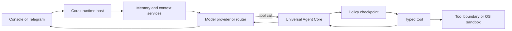

# Corax Agent


Corax is a local-first agent runtime with an inline terminal interface,
typed extensions, persistent sessions, optional long-term memory, Telegram
access, and a policy-enforced execution kernel.

The project is intentionally split across small repositories. `agent-core`
remains the universal execution kernel; Corax composes it with tools, model and
channel connectors, memory providers, and host-only runtime services. Only
tools are exposed to the model.

## Production model

Corax is distributed as a source composition pinned to immutable Git commits.
The installer creates an isolated Python environment, checks out every
component at the release lock, and writes one `corax` launcher. It does not
modify the global Python installation or overwrite an existing deployment.
The base `corax-agent` package depends only on `agent-core`, `agent-sdk`, and
`corax-ui`; every other component is optional and comes from that release lock.

Current runtime requirements:

- macOS or Linux;
- Python 3.12 or newer;
- Git;
- an OpenAI-compatible model endpoint;
- Docker, or macOS Seatbelt, when the shell tool is enabled.

Telegram, SearXNG, MCP servers, and durable memory services are optional.

## Install

Use the reproducible installer from
[`corax-distribution`](https://github.com/Alex12571333/corax-distribution):

```bash
git clone https://github.com/Alex12571333/corax-distribution.git
cd corax-distribution

# Inspect the exact repositories, commits, and commands first.
python3 -m corax_distribution --prefix ~/.corax --dry-run

# Install into a fresh prefix.
python3 -m corax_distribution --prefix ~/.corax

# Configure and verify the agent.
~/.corax/bin/corax setup
~/.corax/bin/corax doctor
```

The installed configuration is stored at `~/.corax/runtime/corax.yaml`.
Runtime data, audit records, checkpoints, traces, and logs stay under the same
runtime directory unless the paths are changed in the configuration.

## First run

Start the inline terminal interface:

```bash
~/.corax/bin/corax
# The explicit form is equivalent:
~/.corax/bin/corax tui
```

On a new installation Corax launches a guided terminal setup before opening
chat. The wizard:

1. acknowledges the execution risk;
2. selects the workspace;
3. configures an OpenAI-compatible endpoint and model;
4. verifies inference with a real minimal completion;
5. selects memory and security modes;
6. optionally enables Telegram.

Run `corax setup` again at any time. Existing values are offered as defaults.
Secrets are read from environment variables and are never written to
`corax.yaml`.

Use `corax chat` when a simple line-oriented console is preferable, for
example in a minimal terminal or while diagnosing display compatibility.
Normal startup is quiet; the full extension inventory is available through
`corax status` and at `DEBUG` log level instead of being printed before chat.

Inside terminal chat, use:

```text
/help
/new
/status
/approve
/deny
/security status
/security mode ask
/security mode auto
/security mode full
/security mode full <challenge>
/security approve <task-id> once|turn|session
/security deny <task-id> once|rule
/memory status
/memory search <query>
/memory remember <text>
/exit
```

`/approve` and `/deny` keep the safe one-shot default and resolve the current
pending tool request without asking you to copy its task ID. Explicit security
commands may allow the exact operation once, for the current turn, or for the
current session; a denial may be one-shot or create a narrow deny rule.

## Interface

`corax` opens the inline
[`corax-tui`](https://github.com/Alex12571333/corax-tui) by default. Completed
messages, tool calls, approvals, and answers are appended once to the
terminal's native scrollback. Only the current streaming tail, context bar,
composer, and completion menu are redrawn. Corax does not enter the alternate
screen, capture the mouse, or put the transcript inside a fixed viewport with
its own scrollbar.

Terminal scrolling, selection, search, and copy mode therefore keep working
normally while Corax is open. On exit, the live footer is removed, terminal
input modes are restored, and the conversation remains above the shell
prompt. Live output is capped to a compact 12-row tail; a completed block moves
to native history without being replayed on later frames.

Real-time thinking is kept separate from the answer and collapsed by default.
Use `Ctrl-T` or `/thinking` to expand or collapse the current block. Typing `/`
opens command suggestions with descriptions. The status bar shows the active
model, context use, security mode, memory provider, and session. Corax
discovers the selected model's real context window from its OpenAI-compatible
`/models` metadata and updates current use from streaming `prompt_tokens`.
Occupied tokens are shown as an exact integer, so adjacent turns cannot be
hidden by `k` rounding. Until provider usage arrives the bar shows unknown or
pending state. The same discovered window drives conservative UTF-8 preflight
compaction. Providers that expose exact token counting publish prompt use
before each model call; streaming `prompt_tokens` refreshes the same metric
after generation starts. Host-owned system blocks are folded into one leading
system message for provider chat-template compatibility.
Conversation checkpoints are retained across turns rather than being cut at a
fixed 40-message UI limit.

Assistant Markdown is rendered as styled headings, lists, quotes, links,
inline emphasis/code, and fenced code blocks while the answer is streaming and
when it settles into scrollback.

The hunter raven ships in both raster and terminal-native forms. iTerm2, Kitty,
and WezTerm display the angry cartoon pixel-art PNG through their native image
protocol. Apple Terminal, other ANSI terminals, and tmux/screen render a
packaged 30×15 Unicode Braille sprite: 60×60 addressable dots with a
cyan-violet holographic gradient, following the same high-detail technique as
the Hermes banner. No runtime converter or optional image dependency is
required.

Every model-selected tool is visible. The TUI and classic console show the
tool name, safe argument summary, approval state, and completion or failure;
Telegram sends the same start, approval, and outcome activity as separate
messages. Raw tool payloads and secret-like arguments are not rendered.
Tool calls are not cached or suppressed: repeated and changed calls remain
available for real multi-step work. In `ask` mode protected calls not covered
by a valid turn/session lease get their own approval; `auto` reviews routine
calls automatically, while `full` still respects immutable denials and
sandbox boundaries.

Telegram document delivery is currently host-controlled. The direct
`telegram_send_document` pseudo-tool is deliberately absent from the model
catalogue until a typed ToolCapability proxy can route it through Agent Core,
Policy, and the connector boundary. Requested workspace artifacts can still be
attached by the gateway's validated host delivery path.

For current or latest outside-world facts, the host adds its trusted local
date, time, and timezone to every model request. `web.search` rewrites stale
years only for current-intent queries and returns URL/date provenance;
`web.fetch` then opens selected public results through DNS-pinned SSRF guards.
The model policy requires search → fetch → cite and forbids inventing facts
when fresh sources are missing or contradictory. Reasoning is bounded by
output tokens, elapsed time, stall time, and a capped TUI buffer.

`corax chat` uses the same streaming chat loop and event contract in a
line-oriented renderer. It remains the minimal compatibility fallback.

Both terminal surfaces use the shared
[`corax-ui`](https://github.com/Alex12571333/corax-ui) visual contract: a
palette designed for near-black terminals, cyan-to-white-to-ultraviolet
holographic light, thin technical borders, compact status labels, and the
Corax raven.

`corax-ui` is a host library, not an Agent Core extension or a model-callable
tool. Its platform-neutral `tokens.json` is the source of truth for color,
typography, spacing, and radius. Future web or desktop surfaces can consume the
same semantic tokens without moving presentation policy into `agent-core`.

Color is enabled automatically for an interactive terminal. Override detection
when needed:

```bash
CORAX_COLOR=always corax
CORAX_COLOR=never corax
NO_COLOR=1 corax
```

Model and tool text is stripped of terminal control sequences before display.
Meaning is always repeated in text or symbols; color is never the only signal.

## CLI

| Command | Purpose |
| --- | --- |
| `corax` or `corax tui` | Open the inline native-scrollback terminal interface. |
| `corax chat` | Open the line-oriented streaming console fallback. |
| `corax setup` | Run the guided setup wizard. |
| `corax settings` | Open the advanced terminal settings menu. |
| `corax gateway` | Run the Telegram gateway. |
| `corax status` | Show loaded extensions and runtime health. |
| `corax doctor` | Run offline readiness checks. |
| `corax security status` | Show the active permission mode. |
| `corax security mode ask\|auto\|full` | Change the permission mode. |
| `corax mcp status` / `corax mcp tools` | Inspect MCP connections and discovered tools. |
| `corax skills list` / `corax skills reload` | Inspect or reload trusted Agent Skills. |
| `corax hooks status` / `corax hooks reload` | Inspect or reload approved hooks. |
| `corax subagents` | Show delegation limits and counters. |
| `corax sandbox` | Show the active isolation backend. |
| `corax models` | Show model routes and fallbacks. |
| `corax observability` | Show the bounded local trace sink. |
| `corax eval` | Run ecosystem contract checks when `corax-evals` is installed. |
| `corax init` | Create configuration and runtime directories, then exit. |

Use another configuration file with
`corax --config /path/to/corax.yaml <command>`.

## Security

The default mode is `ask`.

| Mode | Behaviour |
| --- | --- |
| `ask` | Safe read-only work runs; guarded actions require operator confirmation. |
| `auto` | A deterministic reviewer allows declared low/medium-risk work and asks for high, critical, dangerous, or unknown work. Reviewer errors fail closed. |
| `full` | The policy layer permits work except immutable hard denials. Tool and OS boundaries still apply. |

Entering `full` is deliberately a two-step operation:

```bash
corax security mode ask
corax security mode auto

# Request full mode; Corax prints a short challenge.
corax security mode full
# Repeat the command with that exact challenge.
corax security mode full <challenge>
```

The same grammar is available inside terminal chat with a leading slash:
`/security mode ask`, `/security mode auto`, and the two-step
`/security mode full` sequence.

`full` does not disable blocked capabilities, administrator deny lists,
workspace confinement, shell validation, network restrictions, or the OS
sandbox. The selected policy is injected into Agent Core by the host and is
never exposed as a model-callable tool.

For remote Telegram control, allow only explicit administrators:

```bash
export CORAX_SECURITY_ADMIN_IDS="12345,67890"
export CORAX_TELEGRAM_ALLOWED_CHATS="12345,67890"
```

Security mode changes are persisted atomically. Control events are written to
an append-only JSONL audit log with secret-like values redacted.

## Memory

Memory is integrated into both console and Telegram turns:

```text
user turn
  -> bounded recall
  -> recalled text inserted as untrusted context
  -> model and tool execution
  -> privacy-aware retention
```

The stock configuration uses `memory.none`, so long-term retention is off until
the operator selects a backend. The production composition includes two typed
providers:

- [`universal-agent-memory`](https://github.com/Alex12571333/universal-agent-memory)
  for a durable, self-hosted memory service;
- [`mnemonic-vault`](https://github.com/Alex12571333/mnemonic-vault) for a
  file-first long-term memory service.

Select the provider with `corax setup`. Set `UAM_API_KEY` or
`MNEMONIC_VAULT_API_TOKEN` in the environment when the selected service
requires authentication. The memory loop bounds recalled context, treats it
as data rather than instructions, and rejects secret-like facts during
retention. Console conversation checkpoints are independent of long-term
memory and are stored by `state.file`.

## Configuration and secrets

Use `corax setup` for onboarding and `corax settings` for advanced edits. The
configuration may be YAML or JSON; see [`docs/CONFIG.md`](docs/CONFIG.md) for
the complete schema.

Common secret and integration variables:

| Variable | Purpose |
| --- | --- |
| `CORAX_LLM_API_KEY` | Bearer token for the OpenAI-compatible model endpoint. |
| `CORAX_TELEGRAM_BOT_TOKEN` | Telegram bot token. |
| `CORAX_TELEGRAM_ALLOWED_CHATS` | Comma-separated Telegram chat allow-list. |
| `CORAX_SECURITY_ADMIN_IDS` | Remote actors allowed to change policy or resolve approvals. |
| `CORAX_WEBSEARCH_TOKEN` | Optional bearer token for the configured SearXNG proxy. |
| `UAM_API_KEY` | Universal Agent Memory credential. |
| `MNEMONIC_VAULT_API_TOKEN` | Mnemonic Vault credential. |
| `CORAX_MCP_SERVERS_JSON` | MCP server definitions. |
| `CORAX_SKILLS_PATHS` | Trusted Skill roots separated by the OS path separator. |
| `CORAX_HOOKS_JSON` | Lifecycle hook definitions. |
| `CORAX_HOOK_APPROVALS_JSON` | Approved hook fingerprints. |
| `CORAX_SANDBOX_BACKEND` | `auto`, `seatbelt`, or `docker`. |
| `CORAX_COLOR` | Terminal color policy: `auto`, `always`, or `never`. |
| `NO_COLOR` | Disable terminal color when `CORAX_COLOR` is not explicit. |

Do not store tokens in `corax.yaml`, prompts, extension manifests, or Git.

## Architecture



The package kind defines how a component participates in the runtime:

| Kind | Responsibility | Model-callable |
| --- | --- | --- |
| `tool` | Performs an action selected by the model. | Yes, through Agent Core. |
| `channel_connector` | Receives and sends messages. | No. |
| `model_provider` | Calls or hosts a model. | No. |
| `memory_provider` | Stores and recalls long-lived memory. | No. |
| `policy_provider` | Makes authorization decisions. | No. |
| `runtime_service` | Runs host orchestration such as MCP, hooks, or memory flow. | No. |
| `storage_provider` | Persists host and session state. | No. |
| `observability` | Receives redacted execution records. | No. |

This boundary is the main architectural invariant: a component does not become
a tool merely because it has callable methods. Security, memory, models,
channels, storage, and orchestration never enter the model's tool registry.

### Repository map

Foundation:

| Repository | Role |
| --- | --- |
| [`agent-core`](https://github.com/Alex12571333/agent-core) | Universal execution kernel: tasks, routing, policy checkpoints, stores, events, and traces. It has no Corax dependency. |
| [`agent-sdk`](https://github.com/Alex12571333/agent-sdk) | Typed extension contracts, decorators, manifests, and validation. |

Host and operator surfaces:

| Repository | Role |
| --- | --- |
| [`corax-agent`](https://github.com/Alex12571333/corax-agent) | Composition host, lifecycle, configuration, CLI, and runtime bindings. |
| [`corax-console`](https://github.com/Alex12571333/corax-console) | First-run wizard and interactive terminal chat. |
| [`corax-tui`](https://github.com/Alex12571333/corax-tui) | Inline native-scrollback terminal host: streaming tail, collapsed thinking, formatted answers, adaptive PNG/Braille hunter hologram, visible tools and approvals, context bar, and slash completion. |
| [`corax-ui`](https://github.com/Alex12571333/corax-ui) | Shared design tokens and dependency-free terminal renderer; not a runtime extension. |
| [`corax-gateway-capability`](https://github.com/Alex12571333/corax-gateway-capability) | Channel-neutral sessions and gateway policy. |
| [`corax-distribution`](https://github.com/Alex12571333/corax-distribution) | Immutable release lock and isolated source-composition installer. |

Agent tools:

| Repository | Role |
| --- | --- |
| [`corax-filesystem-capability`](https://github.com/Alex12571333/corax-filesystem-capability) | Workspace-confined filesystem operations. |
| [`corax-editor-capability`](https://github.com/Alex12571333/corax-editor-capability) | Targeted text edits inside the workspace. |
| [`corax-shell-capability`](https://github.com/Alex12571333/corax-shell-capability) | Guarded local command execution. |
| [`corax-web-search-capability`](https://github.com/Alex12571333/corax-web-search-capability) | One web capability bundle: current-aware SearXNG search plus guarded public-page fetch for grounded citations. |
| [`corax-plugin-tool-discovery`](https://github.com/Alex12571333/corax-plugin-tool-discovery) | Manifest-only tool catalog and top-K selection helper; not a runtime extension. |

Models and channels:

| Repository | Role |
| --- | --- |
| [`corax-llm-local-connector`](https://github.com/Alex12571333/corax-llm-local-connector) | OpenAI-compatible local model provider. |
| [`corax-model-router`](https://github.com/Alex12571333/corax-model-router) | Provider routing and retryable fallback. |
| [`corax-telegram-connector`](https://github.com/Alex12571333/corax-telegram-connector) | Telegram transport, streaming, commands, and formatting. |

Memory, state, and context:

| Repository | Role |
| --- | --- |
| [`corax-memory-loop`](https://github.com/Alex12571333/corax-memory-loop) | Bounded recall and privacy-aware retention around every turn. |
| [`universal-agent-memory`](https://github.com/Alex12571333/universal-agent-memory) | Durable self-hosted memory backend and typed Corax adapter. |
| [`mnemonic-vault`](https://github.com/Alex12571333/mnemonic-vault) | File-first memory backend and typed Corax adapter. |
| [`corax-state-store`](https://github.com/Alex12571333/corax-state-store) | Atomic local checkpoints. |
| [`corax-context-manager`](https://github.com/Alex12571333/corax-context-manager) | Deterministic compaction driven by the discovered model window with provider-calibrated reporting. |

Runtime controls and integrations:

| Repository | Role |
| --- | --- |
| [`corax-security-policy`](https://github.com/Alex12571333/corax-security-policy) | `ask`, `auto`, and `full` authorization modes with audit. |
| [`corax-mcp-manager`](https://github.com/Alex12571333/corax-mcp-manager) | MCP client and policy-gated remote tool bridge. |
| [`corax-skills-runtime`](https://github.com/Alex12571333/corax-skills-runtime) | Progressive loading of trusted Agent Skills. |
| [`corax-hooks-runtime`](https://github.com/Alex12571333/corax-hooks-runtime) | Fingerprint-approved lifecycle hooks. |
| [`corax-subagents`](https://github.com/Alex12571333/corax-subagents) | Bounded leaf-agent delegation in isolated contexts. |
| [`corax-sandbox-executor`](https://github.com/Alex12571333/corax-sandbox-executor) | Fail-closed Seatbelt or Docker shell backend. |
| [`corax-observability`](https://github.com/Alex12571333/corax-observability) | Bounded, privacy-first JSONL traces. |
| [`corax-evals`](https://github.com/Alex12571333/corax-evals) | Deterministic ecosystem and core-independence checks. |

The full execution design is documented in
[`docs/ARCHITECTURE.md`](docs/ARCHITECTURE.md). The developer contract and the
kind-selection rules are in [`docs/EXTENDING.md`](docs/EXTENDING.md).

## Operations

Run these checks after installation or configuration changes:

```bash
corax doctor
corax status
corax security status
corax sandbox
corax models
corax observability
```

`corax doctor` does not contact external services. The setup wizard performs
the model connectivity check. A shell request fails closed when neither an
approved Seatbelt nor Docker backend is available.

The distribution installer requires a fresh prefix by design. For versioned
side-by-side upgrades it migrates the active installation's configuration,
data (including security mode and memory), and workspace into the new prefix;
logs, caches, environments, and source trees stay isolated. Validate the new
release before switching the operator-facing launcher.

## Development

Keep the component repositories as siblings, matching the paths in
`corax.yaml`, then create a development environment:

```bash
python3 -m venv .venv
. .venv/bin/activate
python -m pip install -e ".[yaml,dev]"
python -m unittest discover -s tests -t .
corax eval
```

Every extension must ship an `extension.json` manifest, implement the matching
Agent Core contract, and pass SDK validation. Tool execution must go through
Agent Core; infrastructure extensions must be invoked through their typed host
contracts.

## License

MIT. Individual extension repositories may declare their own licenses.
